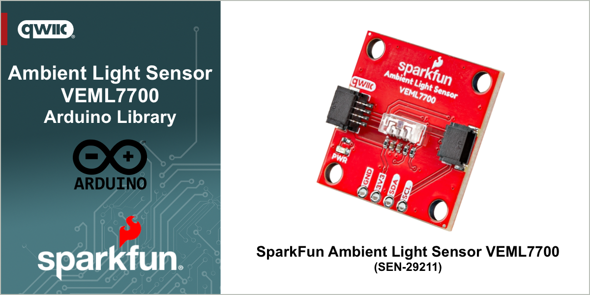

# SparkFun Ambient Light Sensor - VEML7700 Arduino Library

SparkFun Ambient Light Sensor - VEML7700 - AS7343 (QWIIC)

This library provides full access to the functions of the VEML7700 Ambient Light Sensor through an I2C connection using the SparkFun Qwiic connectors and cables. 

> [!NOTE]
> Version 2.0 and above of this library is not completely backward compatable with the original version 1.0 SparkX version. 
>
> Most operations will work, but the data types for `shutdown` and methods used `interrupts` has changed to simplify the API. See the online documentation and examples for further information.

### Supported Products
This library is intended for use with the following SparkFun Product - available at [www.sparkfun.com](https://www.sparkfun.com). 

| Product | Description|
|--|--|
|[SparkFun Ambient Light Sensor - VEML7700 (Qwiic)](https://www.sparkfun.com/sparkfun-ambient-light-sensor-veml7700-qwiic.html) | The SparkFun Qwiic VEML7700 Ambient Light Sensor provides accurate, 16-bit ambient light readings from 0 to 167,000 lux via the I2C interface. This miniature sensor (6.8mm x 3.0mm x 2.5mm) features a high-sensitivity photodiode, a low-noise amplifier, and a 16-bit analog-to-digital (A/D) converter. Its unshifted 7-bit I2C address is 0x10.|

## Documentation

|Reference | Description |
|---|---|
|[Library Documentation](https://docs.sparkfun.com/SparkFun_VEML7700_Arduino_Library/)| The full documentation and API for this Arduino library|
|[SparkFun Ambient Light Sensor - VEML7700 (Qwiic)](https://github.com/sparkfun/SparkFun_Ambient_Light_Sensor-VEML7700)| Hardware GitHub Repository|
|[Hook Up Guide - SparkFun Ambient Light Sensor - VEML7700 (Qwiic)](https://docs.sparkfun.com/SparkFun_Ambient_Light_Sensor-VEML7700/introduction/) | Hardware Overview and Quick Start for the Ambient Light Sensor - VEML7700|
|[SparkFun Ambient Light Sensor - VEML7700 (Qwiic)](https://github.com/sparkfun/SparkFun_VEML7700_Arduino_Library)| Arduino Library - GitHub Repository|
|[VEML7700 Datasheet](https://cdn.sparkfun.com/assets/a/2/b/a/4/VEML7700_Datasheet.pdf) | Datasheet for the VEML7700 IC|
|[Installing an Arduino Library Guide](https://learn.sparkfun.com/tutorials/installing-an-arduino-library)| Basic information on how to install an Arduino library|

## Examples

The following examples are provided with the library

| Example | Description |
|---|---|
|[Read LUX Value](examples/Example1_getLux/Example1_getLux.ino)| Take basic readings from the sensor - read the currently detect LUX value.|
|[Change Settings](examples/Example2_changeSettings/Example2_changeSettings.ino)| Change the operational settings of the sensor|
|[Threshold Settings](examples/Example3_threshold/Example3_threshold.ino)| Set threshold values and check for threshold triggered interrupts.|
|[Power Settomgs](examples/Example4_shutDown/Example4_shutDown.ino)| Shows how to shutdown and power up the sensor.|
|[Production Test](examples/Example5_ProductionTest/Example5_ProductionTest.ino)| Test used during board production |

## License Information

This product is ***open source***!

This product is licensed using the [MIT Open Source License](https://opensource.org/license/mit).

